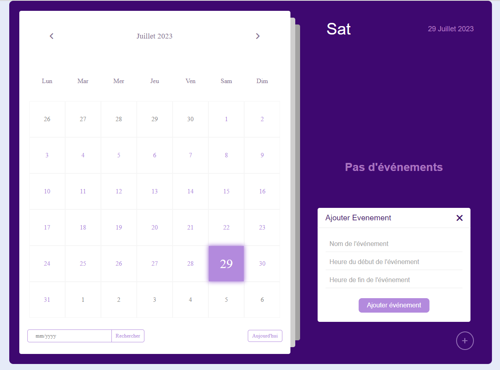

# Calendrier & TODO liste

## Appercu
Cette application web est un calendrier dynamique accompagné d'une TODO liste, conçu pour aider les utilisateurs à organiser leurs emplois du temps et leurs tâches de manière efficace. Réalisé avec JavaScript, HTML et CSS, ce projet offre une interface intuitive et interactive où les utilisateurs peuvent gérer facilement leurs activités quotidiennes et planifier à l'avance.

## Fonctionnalités

- Calendrier Interactif : L'application présente un calendrier clair et réactif qui permet aux utilisateurs de naviguer facilement entre les différents mois et années. Il offre une visualisation claire des événements, des échéances et des rendez-vous.

- Intégration de la TODO liste : L'application comprend une intégration fluide d'une liste TODO, permettant aux utilisateurs de noter des tâches, de définir des priorités et de les marquer comme terminées.

- Conception Réactive : L'interface s'adapte de manière élégante à différentes tailles d'écran, la rendant accessible et conviviale aussi bien sur ordinateur que sur appareils mobiles.
